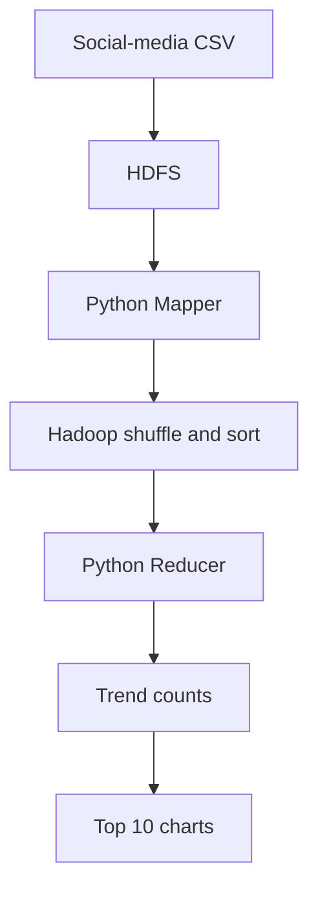

# Social Media Trend Analyzer

A Big Data mini-project that identifies trending keywords and hashtags from social-media posts using **HDFS**, **Hadoop Streaming MapReduce**, **YARN**, and **Python**.


## Project overview

The project processes a reproducible dataset of 50,000 synthetic social-media posts. A Python Mapper extracts keywords and hashtags, Hadoop performs distributed shuffle and sort, and a Python Reducer calculates total frequencies. A final Python program ranks the results and creates charts.

> The included generator creates synthetic posts for a safe, repeatable college demonstration. The same pipeline can process an appropriately licensed real-world CSV dataset without changing the MapReduce design.

## Architecture



## Features

- Generates a deterministic 50,000-post dataset.
- Accepts CSV or plain-text social-media posts.
- Normalizes hashtag and keyword case.
- Removes URLs, mentions, hashtags from keyword text, and common stop words.
- Separates output keys as `H:` for hashtags and `K:` for keywords.
- Runs Mapper and Reducer through Hadoop Streaming on YARN.
- Stores input and output in HDFS.
- Produces Top 10 rankings and PNG bar charts.
- Includes reproducible Hadoop configuration for a single-node cluster.

## Technologies

| Component | Technology |
|---|---|
| Distributed storage | Hadoop HDFS |
| Parallel processing | Hadoop Streaming MapReduce |
| Resource management | YARN |
| Data processing | Python 3 |
| Visualization | Matplotlib |
| Development environment | GitHub Codespaces / Linux |
| Version control | Git and GitHub |

## Project structure

```text
Social-Media-Trend-Analyzer/
├── data/
│   └── sample_posts.csv
├── docs/
│   ├── PROJECT_REPORT.md
│   └── VIVA_QUESTIONS.md
├── hadoop-config/
│   ├── core-site.xml
│   ├── hdfs-site.xml
│   ├── mapred-site.xml
│   └── yarn-site.xml
├── results/
│   ├── top_hashtags.png
│   └── top_keywords.png
├── scripts/
│   ├── analyze_results.py
│   ├── configure_hadoop.sh
│   ├── generate_dataset.py
│   └── run_hadoop.sh
├── mapper.py
├── reducer.py
├── requirements.txt
└── README.md
```

## Hadoop setup used for this project

- Apache Hadoop 3.4.3
- OpenJDK 11
- Single-node pseudo-distributed HDFS and YARN
- Hadoop location: `/workspaces/hadoop-3.4.3`
- Persistent HDFS data: `/workspaces/hadoop_data`

Save these environment variables in `~/.bashrc`:

```bash
export JAVA_HOME=/usr/lib/jvm/java-11-openjdk-amd64
export HADOOP_HOME=/workspaces/hadoop-3.4.3
export PATH="$HADOOP_HOME/bin:$HADOOP_HOME/sbin:$PATH"
```

Apply the repository configuration:

```bash
source ~/.bashrc
bash scripts/configure_hadoop.sh
```

Format the NameNode only on the first setup:

```bash
hdfs namenode -format -force -nonInteractive
```

**Never format the NameNode again unless all HDFS data is intentionally being reset.**

Start Hadoop:

```bash
hdfs --daemon start namenode
hdfs --daemon start datanode
yarn --daemon start resourcemanager
yarn --daemon start nodemanager
jps
```

Expected services are `NameNode`, `DataNode`, `ResourceManager`, and `NodeManager`.

## Run the project

Create the large dataset:

```bash
python3 scripts/generate_dataset.py --count 50000
```

Run the Hadoop job:

```bash
bash scripts/run_hadoop.sh
```

Create the Python environment and charts:

```bash
python3 -m venv .venv
source .venv/bin/activate
python -m pip install -r requirements.txt
python scripts/analyze_results.py
```

## Mapper and Reducer logic

The Mapper emits one key-value pair for each valid item:

```text
K:python    1
H:#ai       1
```

Hadoop groups identical keys during shuffle and sort. The Reducer adds their values:

```text
K:python    9522
H:#ai       6257
```

## Final results

### Top keywords

| Rank | Keyword | Frequency |
|---:|---|---:|
| 1 | data | 15,931 |
| 2 | python | 9,522 |
| 3 | learning | 8,248 |
| 4 | analytics | 8,172 |
| 5 | ai | 6,974 |
| 6 | cloud | 5,993 |
| 7 | machine | 5,861 |
| 8 | distributed | 4,283 |
| 9 | understand | 4,160 |
| 10 | big | 4,113 |

### Top hashtags

| Rank | Hashtag | Frequency |
|---:|---|---:|
| 1 | #artificialintelligence | 6,297 |
| 2 | #ai | 6,257 |
| 3 | #machinelearning | 6,234 |
| 4 | #datascience | 4,342 |
| 5 | #programming | 4,268 |
| 6 | #python | 4,151 |
| 7 | #hadoop | 3,659 |
| 8 | #mapreduce | 3,615 |
| 9 | #bigdata | 3,602 |
| 10 | #technology | 3,406 |

The successful run processed 50,000 posts with two mapper outputs merged, 144 reduced output records, and zero failed shuffles.

## HDFS paths

| Purpose | Path |
|---|---|
| Input | `/social_media/input/posts.csv` |
| Output | `/social_media/output` |
| Local count result | `results/trend_counts.tsv` |

## Stop Hadoop safely

```bash
yarn --daemon stop nodemanager
yarn --daemon stop resourcemanager
hdfs --daemon stop datanode
hdfs --daemon stop namenode
```

## Documentation

- [Complete project report](docs/PROJECT_REPORT.md)
- [Viva questions and answers](docs/VIVA_QUESTIONS.md)
