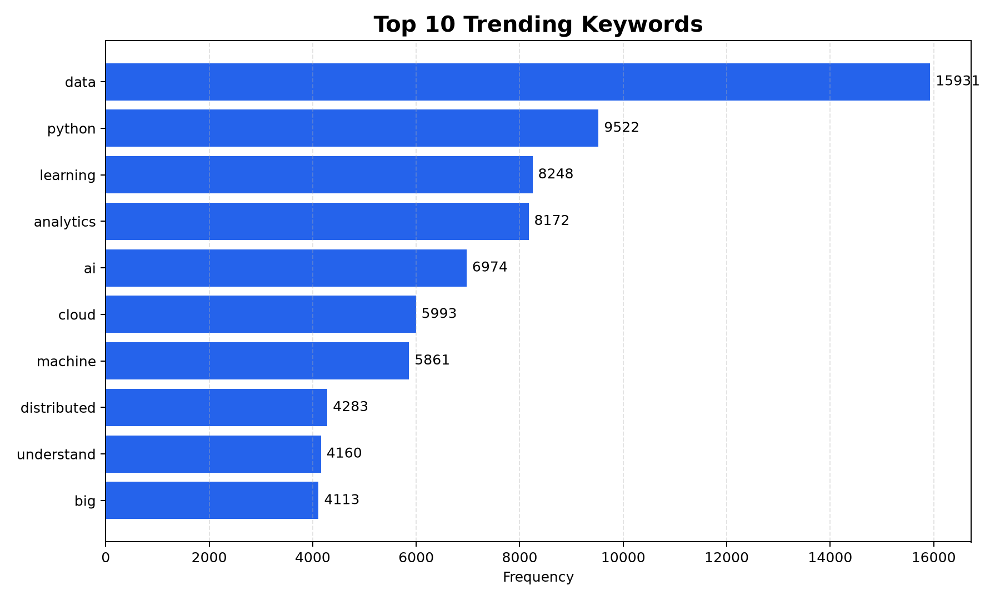
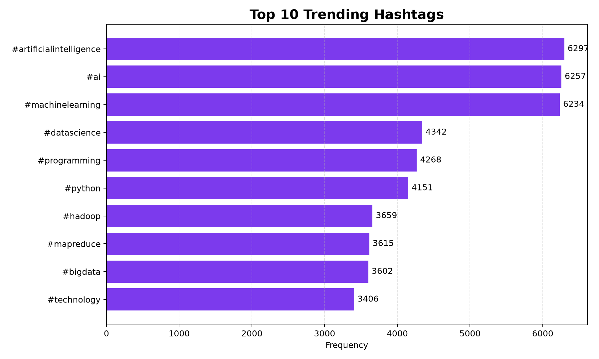

# Social Media Trend Analyzer 📊

A **Big Data analytics project** that identifies trending keywords and hashtags from social-media posts using **Apache Hadoop, HDFS, Hadoop Streaming MapReduce, YARN, Python, and Streamlit**.

The project demonstrates a complete distributed-data pipeline: dataset generation → HDFS storage → MapReduce processing → trend ranking → visualization → web dashboard.





## Project Overview

The system processes a reproducible dataset of **50,000 synthetic social-media posts**. A Python Mapper extracts normalized keywords and hashtags, Hadoop performs distributed shuffle and sort, and a Python Reducer calculates total frequencies. Python then ranks the results and produces charts, while Streamlit provides an interactive dashboard for presenting the completed Hadoop output.

> The dataset is synthetic and deterministic so the project can be reproduced safely for academic demonstrations. The results should not be presented as measurements of a real social-media platform.

## Architecture

```text
Social Media Dataset
        |
        v
      HDFS
        |
        v
  Python Mapper
        |
        v
Hadoop Shuffle & Sort
        |
        v
  Python Reducer
        |
        v
   Trend Counts
        |
        +-------------------+
        |                   |
        v                   v
Python/Matplotlib      Streamlit Dashboard
```

## Key Features

- Generates a deterministic 50,000-post dataset
- Stores input and output using Hadoop HDFS
- Uses Hadoop Streaming with Python Mapper and Reducer programs
- Runs processing through YARN
- Extracts both keywords and hashtags
- Normalizes text and removes URLs, mentions and common stop words
- Produces ranked Top 10 trends
- Generates Matplotlib charts
- Includes an interactive Streamlit dashboard
- Provides downloadable result data
- Includes Hadoop single-node configuration and project documentation

## Tech Stack

| Component | Technology |
|---|---|
| Distributed storage | Apache Hadoop HDFS |
| Distributed processing | Hadoop Streaming MapReduce |
| Resource management | YARN |
| Data processing | Python 3 |
| Data handling | Pandas |
| Visualization | Matplotlib |
| Dashboard | Streamlit |
| Environment | Linux / GitHub Codespaces |
| Version control | Git & GitHub |

## Project Structure

```text
Social-Media-Trend-Analyzer/
├── .streamlit/
├── data/
│   └── sample_posts.csv
├── docs/
│   ├── PROJECT_REPORT.md
│   └── VIVA_QUESTIONS.md
├── hadoop-config/
│   ├── core-site.xml
│   ├── hdfs-site.xml
│   ├── mapred-site.xml
│   └── yarn-site.xml
├── results/
│   ├── top_hashtags.png
│   ├── top_keywords.png
│   └── trend_summary.csv
├── scripts/
│   ├── analyze_results.py
│   ├── configure_hadoop.sh
│   ├── generate_dataset.py
│   └── run_hadoop.sh
├── app.py
├── mapper.py
├── reducer.py
├── requirements.txt
└── README.md
```

## Processing Logic

### Mapper

For every valid keyword or hashtag, the Mapper emits a key and the value `1`.

```text
K:python    1
H:#ai       1
```

### Shuffle and Sort

Hadoop automatically groups identical keys before sending them to the Reducer.

### Reducer

The Reducer sums the values associated with each key.

```text
K:python    9522
H:#ai       6257
```

## Completed Run

The documented successful run processed:

- **50,000 posts**
- **2 mapper outputs merged**
- **144 reduced trend records**
- **0 failed shuffles**

### Top Keywords

| Rank | Keyword | Frequency |
|---:|---|---:|
| 1 | data | 15,931 |
| 2 | python | 9,522 |
| 3 | learning | 8,248 |
| 4 | analytics | 8,172 |
| 5 | ai | 6,974 |

### Top Hashtags

| Rank | Hashtag | Frequency |
|---:|---|---:|
| 1 | #artificialintelligence | 6,297 |
| 2 | #ai | 6,257 |
| 3 | #machinelearning | 6,234 |
| 4 | #datascience | 4,342 |
| 5 | #programming | 4,268 |

## Hadoop Environment Used

- Apache Hadoop 3.4.3
- OpenJDK 11
- Single-node pseudo-distributed HDFS and YARN
- GitHub Codespaces / Linux

## Running the Hadoop Pipeline

Configure Hadoop using the repository configuration:

```bash
bash scripts/configure_hadoop.sh
```

Start the required Hadoop/YARN daemons and confirm them with `jps`.

Generate the reproducible dataset:

```bash
python3 scripts/generate_dataset.py --count 50000
```

Run the MapReduce job:

```bash
bash scripts/run_hadoop.sh
```

Generate the analyzed result files and charts:

```bash
python3 -m venv .venv
source .venv/bin/activate
python -m pip install -r requirements.txt
python scripts/analyze_results.py
```

## Run the Dashboard

After installing the Python requirements:

```bash
streamlit run app.py
```

The dashboard displays the version-controlled results produced by the completed Hadoop run. Hadoop itself runs separately from the deployed Streamlit dashboard.

## HDFS Paths

| Purpose | Path |
|---|---|
| Input | `/social_media/input/posts.csv` |
| Output | `/social_media/output` |
| Local count result | `results/trend_counts.tsv` |

## Documentation

Detailed academic documentation is available in the `docs/` directory:

- `PROJECT_REPORT.md` — project explanation and implementation details
- `VIVA_QUESTIONS.md` — viva preparation questions and answers

## Future Scope

- Analyze permitted real-world social-media API data
- Add sentiment analysis
- Detect trending phrases instead of individual words only
- Add time-window based trend analysis
- Support multilingual text
- Run on a multi-node Hadoop cluster
- Add near-real-time ingestion

## Skills Demonstrated

**Big Data Analytics · Apache Hadoop · HDFS · MapReduce · YARN · Python · Streamlit · Data Visualization · Linux · Git/GitHub**

---

Built as a Big Data mini-project demonstrating distributed text processing and trend analysis with the Hadoop ecosystem.
