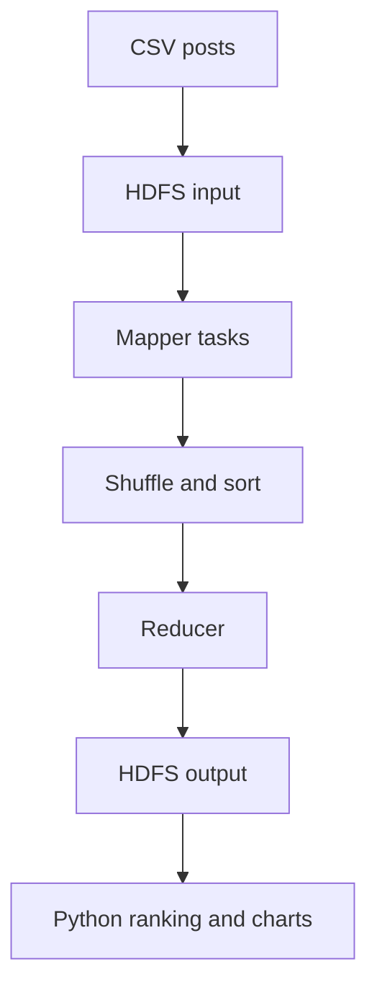

# Project Report: Social Media Trend Analyzer

## Title page details

**Project title:** Social Media Trend Analyzer Using Hadoop MapReduce  
**Domain:** Big Data Analytics / Social Media Text Analytics  
**Student names:** ______________________________  
**USNs:** ______________________________________  
**Department:** Computer Science and Engineering  
**Institution:** ________________________________  
**Academic year:** 2026–2027

## Abstract

Social-media platforms generate large volumes of unstructured text containing opinions, discussions, keywords, and hashtags. Manually identifying popular topics from this data is slow and unsuitable for large datasets. This project implements a scalable trend-analysis pipeline using Hadoop Distributed File System (HDFS), Hadoop Streaming MapReduce, YARN, and Python.

A deterministic dataset generator creates 50,000 synthetic social-media posts for a safe and reproducible demonstration. HDFS stores the dataset, a Python Mapper extracts normalized keywords and hashtags, Hadoop performs shuffle and sort, and a Python Reducer totals the frequency of every item. A separate Python program ranks the results and generates Top 10 bar charts using Matplotlib. The completed execution produced 144 reduced trend records with zero failed shuffles.

## 1. Introduction

A trend is a subject or label that receives unusually high attention within a collection of posts. Keywords show commonly discussed terms, while hashtags are explicit labels added by users. Trend analysis helps organizations understand public interest, monitor technology discussions, and summarize large text collections.

Traditional single-machine processing becomes less suitable as data volume grows. Hadoop addresses this problem through distributed storage and parallel computation. Although this project uses a single-node cluster for demonstration, its Mapper and Reducer design follows the same model used across multi-node Hadoop clusters.

## 2. Problem statement

Analyze large-scale social-media posts to identify trending keywords and hashtags using Hadoop, MapReduce, and Python.

## 3. Objectives

1. Store a large social-media dataset in HDFS.
2. preprocess text by normalizing case and removing noise.
3. Extract keywords and hashtags using a Python Mapper.
4. Use Hadoop shuffle and sort to group identical keys.
5. Aggregate frequencies using a Python Reducer.
6. Rank the most frequently occurring keywords and hashtags.
7. Visualize the Top 10 results using bar charts.
8. Maintain the complete implementation using Git and GitHub.

## 4. Scope

The project supports CSV files whose final column contains post text, and it can also process plain-text input. It is designed for English-language keyword and hashtag frequency analysis. The included dataset is synthetic and reproducible. An appropriately licensed real dataset can replace it without changing the processing architecture.

## 5. Existing system

Small text-analysis programs often process an entire file sequentially on one computer. Their limitations include:

- Limited scalability.
- High processing time for very large datasets.
- No distributed storage.
- Memory and hardware constraints.
- Greater risk of losing progress after a machine failure.

## 6. Proposed system

The proposed system stores input in HDFS and uses MapReduce to divide processing into independent tasks. The Mapper extracts trend candidates, shuffle and sort group identical keys, and the Reducer calculates final totals. Python then ranks and visualizes the results.

### Architecture



## 7. Hardware and software requirements

### Hardware

- Dual-core processor or better.
- 4 GB RAM minimum; 8 GB recommended.
- At least 5 GB available storage.
- Internet connection for initial setup.

### Software

- Linux or GitHub Codespaces.
- OpenJDK 11.
- Apache Hadoop 3.4.3.
- Python 3.
- Matplotlib.
- Git and GitHub.
- Visual Studio Code.

## 8. Dataset

The generator creates 50,000 synthetic posts with these fields:

| Field | Meaning |
|---|---|
| post_id | Unique post number |
| platform | Simulated social-media platform |
| created_at | ISO-formatted timestamp |
| text | Post text containing keywords and hashtags |

Topics are selected using fixed weighted probabilities so artificial intelligence, Python, Big Data, cloud computing, cybersecurity, IoT, analytics, and blockchain occur at different frequencies. A fixed random seed makes every default run reproducible.

Synthetic data was selected because it has no private user information, does not require a paid API, and can be regenerated at any size for demonstrations.

## 9. Methodology

### 9.1 Data generation

`generate_dataset.py` writes CSV records using predefined topic phrases, hashtags, platforms, timestamps, and weighted sampling.

### 9.2 Storage in HDFS

The generated CSV is uploaded to:

```text
/social_media/input/posts.csv
```

HDFS divides a large file into blocks and manages them through the NameNode and DataNode.

### 9.3 Mapper

For every input post, `mapper.py`:

1. Parses the CSV record.
2. Skips the header.
3. Extracts hashtags with a regular expression.
4. Converts hashtags to lowercase.
5. Removes URLs, user mentions, and hashtag text from keyword processing.
6. extracts alphabetic keyword tokens.
7. Removes stop words.
8. Emits `H:<hashtag>\t1` or `K:<keyword>\t1`.

Example:

```text
Input:  Python makes data analysis easier #Python #DataScience

Output:
K:python       1
K:data         1
K:analysis     1
K:easier       1
H:#python      1
H:#datascience 1
```

### 9.4 Shuffle and sort

Hadoop automatically:

- Transfers Mapper output to the correct Reducer.
- Sorts keys.
- Groups all values belonging to the same key.

This is why the Reducer receives all occurrences of a keyword or hashtag together.

### 9.5 Reducer

`reducer.py` sums the integer values for each grouped key.

Example:

```text
H:#ai 1
H:#ai 1
H:#ai 1
```

becomes:

```text
H:#ai 3
```

### 9.6 Ranking and visualization

`analyze_results.py` separates `K:` and `H:` records, sorts them by descending frequency, prints the Top 10 results, saves a text summary, and produces two horizontal bar charts.

## 10. Implementation

The cluster uses pseudo-distributed mode:

- NameNode and DataNode provide HDFS.
- ResourceManager and NodeManager provide YARN.
- Hadoop Streaming allows Python programs to act as Mapper and Reducer.
- HDFS replication is set to 1 because only one DataNode is available.
- Persistent HDFS directories are placed under `/workspaces/hadoop_data`.

Main execution command:

```bash
bash scripts/run_hadoop.sh
```

The script checks all four Hadoop services, uploads the dataset, removes only the previous project output, executes Hadoop Streaming, and downloads the combined result to `results/trend_counts.tsv`.

## 11. Testing

| Test | Expected result | Actual result |
|---|---|---|
| Hadoop version | Hadoop 3.4.3 | Passed |
| HDFS services | NameNode and DataNode running | Passed |
| YARN services | ResourceManager and NodeManager running | Passed |
| Local Mapper/Reducer test | Hashtag and keyword counts | Passed |
| Dataset generation | 50,000 CSV posts | Passed |
| Hadoop Streaming job | Successful completion | Passed |
| Shuffle errors | 0 | Passed |
| Chart generation | Two readable PNG charts | Passed |

## 12. Results

### Top 10 keywords

| Rank | Keyword | Count |
|---:|---|---:|
| 1 | data | 15,931 |
| 2 | python | 9,522 |
| 3 | learning | 8,248 |
| 4 | analytics | 8,172 |
| 5 | ai | 6,974 |
| 6 | cloud | 5,993 |
| 7 | machine | 5,861 |
| 8 | distributed | 4,283 |
| 9 | understand | 4,160 |
| 10 | big | 4,113 |

### Top 10 hashtags

| Rank | Hashtag | Count |
|---:|---|---:|
| 1 | #artificialintelligence | 6,297 |
| 2 | #ai | 6,257 |
| 3 | #machinelearning | 6,234 |
| 4 | #datascience | 4,342 |
| 5 | #programming | 4,268 |
| 6 | #python | 4,151 |
| 7 | #hadoop | 3,659 |
| 8 | #mapreduce | 3,615 |
| 9 | #bigdata | 3,602 |
| 10 | #technology | 3,406 |

### Hadoop execution observations

- Input posts: 50,000.
- Mapper outputs merged: 2.
- Reduced output records: 144.
- Failed shuffles: 0.
- Output directory: `/social_media/output`.

The result correctly reflects the generator's weighted topic distribution: AI-related hashtags occupy the first three positions, followed by data-science and programming hashtags.

## 13. Advantages

- Scales through MapReduce's parallel model.
- Stores data using HDFS.
- Uses free and open-source technologies.
- Requires no paid social-media API.
- Has reproducible input and output.
- Separates data processing from visualization.
- Can accept a real dataset with minimal changes.

## 14. Limitations

- The supplied dataset is synthetic rather than live social-media data.
- Frequency alone does not detect sentiment or meaning.
- English stop-word filtering is rule-based.
- Related forms such as `machine learning` are counted as separate words.
- Generic context words may require further stop-word tuning.
- A single-node demonstration does not provide real multi-machine fault tolerance.

## 15. Future enhancements

- Connect to a permitted real-time social-media API.
- Add time-window trend detection.
- Detect phrases and n-grams such as “machine learning.”
- Add sentiment analysis.
- Support regional languages.
- Use Apache Spark for iterative analytics.
- Create an interactive dashboard.
- Deploy a multi-node Hadoop cluster.
- Compare trends across platforms and dates.

## 16. Conclusion

The project successfully demonstrates end-to-end Big Data text analytics. It stores 50,000 posts in HDFS, performs parallel keyword and hashtag counting with Hadoop Streaming MapReduce on YARN, and converts the output into ranked charts using Python. The successful run produced meaningful technology trends with no shuffle failures. The modular design can be expanded to larger or real-world datasets.

## 17. References

1. [Apache Hadoop documentation](https://hadoop.apache.org/docs/current/)
2. [Hadoop single-node cluster setup](https://hadoop.apache.org/docs/current/hadoop-project-dist/hadoop-common/SingleCluster.html)
3. [Hadoop Streaming documentation](https://hadoop.apache.org/docs/current/hadoop-streaming/HadoopStreaming.html)
4. [Python documentation](https://docs.python.org/3/)
5. [Matplotlib documentation](https://matplotlib.org/stable/)
